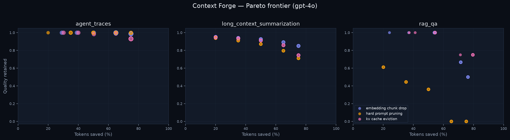
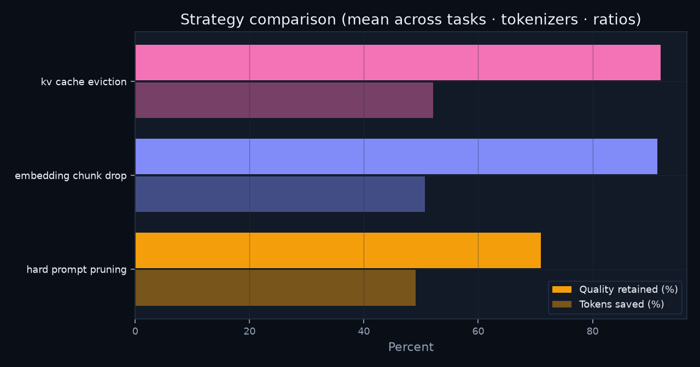

# Context Forge - Writeup

## Goal

Quantify the cost/quality tradeoff of context-compression strategies on a fixed,
real-data task set, and report the **Pareto frontier** over three axes that a real
deployment cares about: **tokens saved**, **quality retained**, and **compression
latency** - per production tokenizer.



## Data (real, public - no synthetic examples)

| Task | Dataset | Split |
|---|---|---|
| RAG / grounded QA | `rajpurkar/squad` | validation |
| Agent traces | `lambda/hermes-agent-reasoning-traces` | train (`kimi` config) |
| Long-context summarization | `ccdv/govreport-summarization` | test |

Dataset ids and splits live in `data/manifest.yml`; nothing is hardcoded.

## Tokenizers

Token savings are measured under the tokenizer the deployment actually pays for, via a
unified backend that dispatches to **tiktoken** or **Hugging Face**:

- `gpt-4o` → tiktoken `o200k_base` (GPT-4o / GPT-4.1)
- `gpt-4` → tiktoken `cl100k_base` (GPT-4 / GPT-3.5-turbo / `text-embedding-3`)
- `gpt-2` → Hugging Face BPE (legacy reference baseline)

## Compression strategies

- `hard_prompt_pruning` - deterministic head/tail token-budget truncation.
- `embedding_chunk_drop` - TF-IDF cosine chunk relevance dropping, anchored on the task query/target.
- `kv_cache_eviction` - text-level proxy for cache eviction: prefix + recent suffix + salient middle chunks.
- `llmlingua` - optional wrapper of open-source LLMLingua-2 (installed via the `[llmlingua]` extra).

## Evaluation

Latency is measured directly (median wall-clock per compression call). Token savings are
computed per tokenizer. **Quality retained** is a task-specific *preservation* score in
[0, 1]: answer-span/token recall for QA, reference-summary keyword coverage for
summarization, and final/tail-trace coverage for agent traces. It is a
compression-preservation proxy, **not** a model-graded answer score - the benchmark is
designed to run end-to-end with no paid inference. The code is structured so an LLM judge
can be added later without changing the static report format.

The Pareto frontier removes, within each `(task, tokenizer)` slice, any point dominated by
another: at least as much token saving, at least as much quality, and no higher latency.

## Results

Averaged across all tasks, tokenizers, and ratios (`1,620` measurements):

| Strategy | Quality retained | Tokens saved | Latency (median) |
|---|---:|---:|---:|
| kv_cache_eviction | 0.919 | 52.2% | 9.3 ms |
| embedding_chunk_drop | 0.914 | 50.7% | 10.2 ms |
| hard_prompt_pruning | 0.709 | 49.1% | 2.7 ms |



Relevance-aware strategies retain ~92% of task signal at ~51% fewer tokens. Naive head/tail
truncation is an order of magnitude faster but collapses to 71% quality on average - and to
0.0 on RAG QA at high compression, because it discards the answer span outright.

## Token droppability classifier

A miniature of the core idea behind learned prompt compression: predict, per token,
whether it can be dropped. Labels are weakly supervised from target overlap (tokens
overlapping target-critical words → keep; others → droppable). Features combine
character n-grams of the token string with positional/lexical signals; the model is
logistic regression.

| ROC-AUC | F1 (droppable) | Accuracy | Precision / Recall |
|---:|---:|---:|---:|
| 0.964 | 0.917 | 88.1% | 0.98 / 0.86 |

The model recovers intuitive structure: morphological fragments/inflections are droppable,
salient content nouns are kept. Artifact saved to `data/results/droppable_classifier.pkl`.

## Reproduce

```bash
python -m pip install -e .
compress-bench run --limit-per-task 12
compress-bench train-classifier --limit-per-task 30
compress-bench plots
```

The Vercel app reads `public/results/latest_results.json` (and
`classifier_report.json`) and renders the latest frontier interactively.
